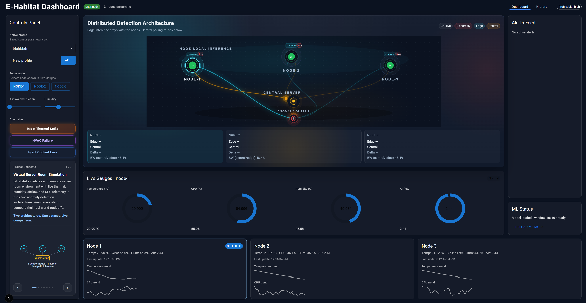
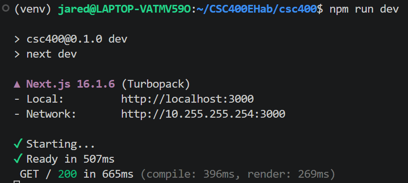
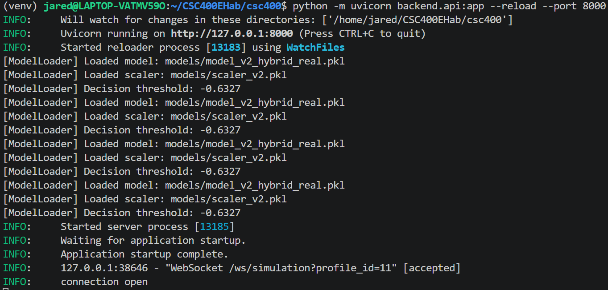

1. Project Description - What the project does

E-Habitat is an interactive simulation platform that models a server room environment with three virtual nodes. Each virtual node can represent any device you would find in a server room, like a server or IoT (Internet of Things) device. Users can inject anomalies, monitor node telemetry, view past history, compare edge and centralized latency metrics, and manually adjust certain node properties.

2. Team Members - Names and contributions

Logan Caraballo - Project Lead / Backend
Jared He - Frontend / UI
Gavin Paeth - Data / Testing

Roles were not concrete; for example, Logan helped Jared with the frontend UI, Jared helped with bug fixes across front and backend, and all of us contributed to external testing, documentation, and other areas.

3. Technologies Used - Languages, frameworks, tools

Frontend:
Languages: TypeScript (typed superset of JavaScript)
Framework: Next.js 16.1.6, React
UI Library: Tailwind CSS, Material UI (used for AlertsFeed)
Charting: Recharts
Backend:
Runtime: Python 3.12.3, Uvicorn
Framework: FastAPI
Validation: Pydantic (built into FastAPI)
Database:
Database: SQLite
Access: Python built-in sqlite3 module - no ORM
Discipline: parameterized queries; raw SQL only; DB writes wrapped in try/except so a failure cannot crash the WebSocket handler
Machine Learning:
scikit-learn 1.8.0
Active model: models/model_v2_hybrid_real.pkl (Isolation Forest, hybrid-trained April 2026)
Active scaler: models/scaler_v2.pkl (RobustScaler - must be applied before inference)
Operational threshold: score < 0.15 (set explicitly in model_loader.py)
Development Tools:
Version control: Git + GitHub
Package Manager: npm, pip
Environment Management: Node.js runtime, Python virtual environment (venv)
Testing Tools: pytest - 33 tests passing across all backend modules

4. Installation Instructions - How to set up locally

In a terminal,
(1) Verify Python installation with command "python3 -- version". If not installed, install it.
(2) Clone the GitHub repository: "git clone https://github.com/JunyiiBlvd/CSC400EHab.git"
(4) Navigate to the project folder in the terminal.
(3) Create the venv: "python3 -m venv venv"
(4) Activate the virtual environment: "source venv/bin/activate"
(5) Install dependencies: "pip install -r requirements.txt"
(6) Run the backend server: "python -m uvicorn backend.api:app --reload --port 8000"

In a second terminal in the project folder,
(7) Install frontend dependencies: "npm install"
(8) Run the frontend page: "npm run dev"

In your browser,
(9) Go to the page: "localhost:3000"

5. Running the Application - How to start/use it

Consult the instructions above.

6. Deployment - How it's deployed (if applicable)

Due to time constraints and scope creep, we were unable to accomplish deployment or containerization. This will be a priority objective for future expansion.

7. Screenshots - 2-3 key screenshots

